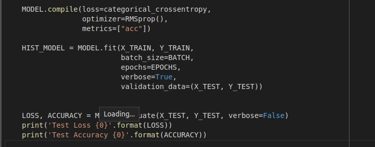

# Self-Normalizing-Neural-Networks-SNN-

Implementation of Self-Normalizing Neural Networks (SNN) on MNIST dataset using Keras.

## Introduction

SNNs keep the neuron activations in the network near
zero mean and unit variance, by employing the following
tools.


---

## Accuracy

accuracy of snn vs accuracy of Batch Normalization

- snn


- Batch normalization
  

- from above graphs seeing the labels we can fighure out that SNN works better than Batch Normalization

---

## Loss

loss of snn vs loss of Batch Normalization

- snn(at a depth of 32)


- Batch normalization (at a depth of 32 - label is wrong)


- snn
  

- Batch normalization
  

- we see that the loss of snn is less than the loss of Batch Normalization and we get a smoother graph.

---

## snippets




---

## Process

1. SELU activation

2. Initialization of weights

3. Alpha-dropout (though dropout is rarely necessary in
   my experience)

4. Scale input features to zero-mean, unit variance.

Constants are chosen appropriately to be:
α = 1.6733 and λ = 1.0507.

## SeLu Layer (under the hood functioning)

```python
if x>0:
    selu(x) = lambda*x
else:
    selu(x) = lambda*alpha*(exp(x)-1)
```

## SeLu Dropout Layer (under the hood functioning)

```python
dropout_ratio = 1 - q
if random > dropout_ratio:
    selu_drop(x) = a*(x)+b
else:
    selu_drop(x) = a*(alpha)+b
```

---

## References

[1] G. Klambauer, T. Unterthiner, A. Mayr, & S. Hochreiter, Self-Normalizing Neural Networks. In I. Guyon, U.V. Luxburg, S. Bengio, H. Wallach, R. Fergus, S. Vishwanathan, & R. Garnett,eds., Advances in Neural Information Processing Systems 30 (Curran Associates, Inc., 2017), pp. 971–980.

[2] I. Yeh, Modeling of strength of high performance concrete using artificial neural networks. In Cement and Concrete Research, Vol. 28, No. 12, pp. 1797-1808 (1998).


